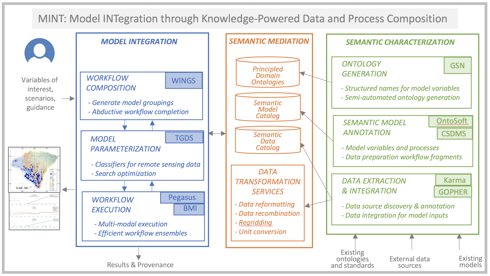

# altoids
A single box of MINT

Inventory

| Name  | Purpose |
| ------------- | ------------- |
| WINGS | job creation |
| TGDS | idea ? |
| PEGASUS | job execution (and, optionally, compute provisioning) |
| BMI | basic model interface |
| Triple Store | not listed but has to be a part ? |
| GSN | idea ? |
| OntoSoft | an ontology thing |
| CSDMS | maybe bmi or some tools under https://github.com/csdms ? |
| Karma | information integration |
| GOPHER | a managed service, it looks like: http://www.complianceservices.com/wp-content/uploads/2018/08/FESTF-Gopher-Improving-Data-Management-Accessibility-and-Use.pdf ? |
| MINT-UI | ui |
| mint-server | part of the UIs backend ? |

